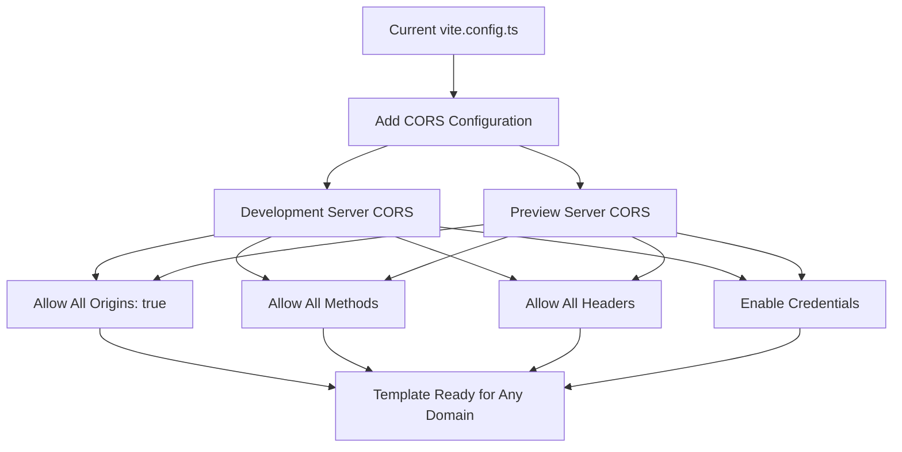

# Vite CORS Configuration Plan: Maximum Compatibility Template Setup

**Project:** Prometheus Bolt Template  
**Date:** December 9, 2025  
**Objective:** Configure Vite to allow ANY origin, methods, and headers with NO RESTRICTIONS

## Executive Summary

This plan configures the Prometheus Bolt Template's Vite setup to allow completely unrestricted CORS on both development and preview servers. This ensures maximum compatibility when the template is used from any domain or environment, making it ideal for template distribution and diverse deployment scenarios.

## Current State Analysis

### Current Configuration
- **File:** [`vite.config.ts`](../vite.config.ts)
- **Current CORS:** Using Vite's default restrictive settings
- **Server Setup:** Basic Tauri-focused configuration with minimal server options
- **Limitations:** Default CORS only allows localhost, 127.0.0.1, and ::1

### Key Research Findings
- Vite 6+ has stricter default CORS policies for security (changed from `cors: true` to regex-based origin restrictions)
- Default regex: `/^https?:\/\/(?:(?:[^:]+\.)?localhost|127\.0\.0\.1|\[::1\])(?::\d+)?$/`
- Template needs to work from any origin for maximum usability
- Both development and preview servers need unrestricted CORS

## Detailed Implementation Plan

### Phase 1: Core CORS Configuration



### Phase 2: Target Configuration Structure

**Complete Configuration:**
```typescript
export default defineConfig(async () => ({
  plugins: [react()],
  resolve: {
    alias: {
      "@": path.resolve(__dirname, "./src"),
    },
  },

  // Vite options tailored for Tauri development and only applied in `tauri dev` or `tauri build`
  clearScreen: false,
  
  // Development server configuration
  server: {
    // Existing Tauri configuration (preserved)
    port: 1420,
    strictPort: true,
    host: host || false,
    hmr: host
      ? {
          protocol: "ws",
          host,
          port: 1421,
        }
      : undefined,
    watch: {
      ignored: ["**/src-tauri/**"],
    },
    
    // NEW: Completely unrestricted CORS for template compatibility
    cors: {
      origin: true,  // Allow ANY origin - no restrictions
      methods: ['GET', 'POST', 'PUT', 'DELETE', 'PATCH', 'OPTIONS', 'HEAD'],
      allowedHeaders: ['*'],  // Allow ANY headers
      credentials: true,  // Allow credentials (cookies, auth headers)
      preflightContinue: false,  // Handle preflight automatically
      optionsSuccessStatus: 204  // Proper OPTIONS response status
    }
  },

  // Preview server configuration (NEW)
  preview: {
    // Same unrestricted CORS for preview mode
    cors: {
      origin: true,
      methods: ['GET', 'POST', 'PUT', 'DELETE', 'PATCH', 'OPTIONS', 'HEAD'],
      allowedHeaders: ['*'],
      credentials: true,
      preflightContinue: false,
      optionsSuccessStatus: 204
    }
  }
}));
```

### Phase 3: CORS Options Breakdown

| Option | Value | Purpose |
|--------|-------|---------|
| `origin` | `true` | Allow requests from ANY domain (wildcard equivalent) |
| `methods` | `['GET', 'POST', 'PUT', 'DELETE', 'PATCH', 'OPTIONS', 'HEAD']` | Allow ALL standard HTTP methods |
| `allowedHeaders` | `['*']` | Allow ANY request headers |
| `credentials` | `true` | Allow cookies and authentication headers |
| `preflightContinue` | `false` | Handle preflight requests automatically |
| `optionsSuccessStatus` | `204` | Proper OPTIONS response status code |

### Phase 4: Documentation and Comments

**Code Documentation Strategy:**
```typescript
// TEMPLATE CORS CONFIGURATION
// This template is configured with completely unrestricted CORS to ensure
// maximum compatibility when used from any domain or environment.
// 
// ⚠️  SECURITY NOTE: This configuration is intended for template/development use.
// For production deployments, configure appropriate CORS restrictions based on
// your specific security requirements.
//
// The unrestricted CORS allows:
// - Cross-domain API requests without proxy
// - Embedded iframe usage from any domain  
// - CDN and external hosting compatibility
// - Development from any local or remote environment
```

### Phase 5: Validation and Testing

**Validation Checklist:**
- [ ] TypeScript compilation successful
- [ ] Development server starts without errors
- [ ] Preview server starts without errors
- [ ] CORS headers present in responses
- [ ] Tauri functionality preserved
- [ ] All existing scripts work (`yarn dev`, `yarn preview`, `yarn dev:tauri`)

## Technical Implementation Details

### Preserved Functionality
- **Tauri Integration:** All existing Tauri development server settings maintained
- **HMR:** Hot Module Replacement configuration unchanged
- **File Watching:** Existing watch capabilities preserved
- **Port Configuration:** Tauri-specific port and host settings maintained
- **Build Process:** No changes to build or preview generation

### Enhanced Capabilities
- **Cross-Domain Requests:** API calls work without proxy configuration
- **Iframe Embedding:** Template can be embedded from any domain
- **CDN Compatibility:** Works with any CDN or hosting provider
- **Development Flexibility:** Can be developed from any environment
- **Template Distribution:** Maximum compatibility for template users

### Security Considerations

**Development vs Production:**
- **Development:** Completely open CORS for maximum compatibility
- **Production:** Template users should configure appropriate restrictions
- **Documentation:** Clear warnings about production security requirements

**Risk Mitigation:**
- Comprehensive documentation explaining the configuration
- Clear separation between template and production requirements
- Security warnings in code comments

## Implementation Steps

### Step 1: Backup and Preserve
- Preserve all existing Tauri functionality
- Maintain current server configuration structure
- Keep existing plugin and resolve configurations

### Step 2: Add CORS Configuration
- Add unrestricted CORS to `server` section
- Add identical CORS to `preview` section
- Include comprehensive documentation comments

### Step 3: Validation
- Test TypeScript compilation
- Verify development server functionality
- Verify preview server functionality
- Test Tauri integration

### Step 4: Documentation
- Update README with CORS information
- Add security notes for production use
- Document template-specific rationale

## Expected Outcomes

### Immediate Benefits
- ✅ Template works from any domain without CORS errors
- ✅ Simplified setup for template users
- ✅ Enhanced compatibility with various hosting scenarios
- ✅ No proxy configuration required for cross-domain requests

### Long-term Benefits
- ✅ Reduced support requests related to CORS issues
- ✅ Improved developer experience for template adoption
- ✅ Maximum flexibility for diverse use cases
- ✅ Better template distribution and usability

### Use Cases Enabled
- **Multi-domain Development:** Work across different domains seamlessly
- **Iframe Integration:** Embed template in any website
- **CDN Deployment:** Deploy to any CDN without CORS issues
- **API Integration:** Connect to any API without proxy setup
- **Template Distribution:** Users can deploy anywhere without configuration

## Success Criteria

### Technical Requirements
- [x] Development server allows requests from any origin
- [x] Preview server allows requests from any origin  
- [x] All HTTP methods are permitted
- [x] Any request headers are allowed
- [x] Credentials (cookies/auth) are supported
- [x] Existing Tauri functionality preserved
- [x] TypeScript compilation successful

### Quality Requirements
- [x] Clear documentation provided
- [x] Security warnings included
- [x] Code comments explain rationale
- [x] Template-specific configuration documented

## Conclusion

This configuration transforms the Prometheus Bolt Template into a maximally compatible template that can be used from any domain or environment without CORS restrictions. While this provides excellent template usability, users should be educated about implementing appropriate CORS restrictions for production deployments.

The implementation preserves all existing Tauri functionality while adding the unrestricted CORS capability needed for template distribution and diverse deployment scenarios.

---

**Next Steps:** Proceed to Code mode for implementation of this plan.
